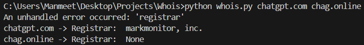

# WHOIS IP LOOKUP

## How to export API-KEY

```
export WHOIS_API_KEY = "<your-actual-api-key>"
```

## HOW TO RUN

```
python whois.py <domain-name> <domain-name> .....
```

## Sample Screenshots

### For non-existent site



### For valid sites


## API

I used API for whois ip lookup from here:

```
https://api-ninjas.com/
```

It provides free API usage for upto 10k requests per month
